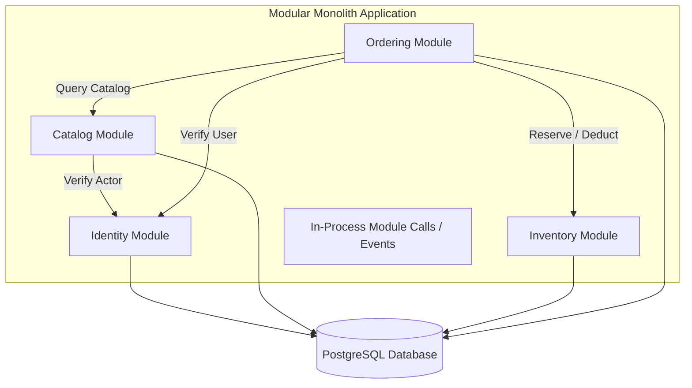
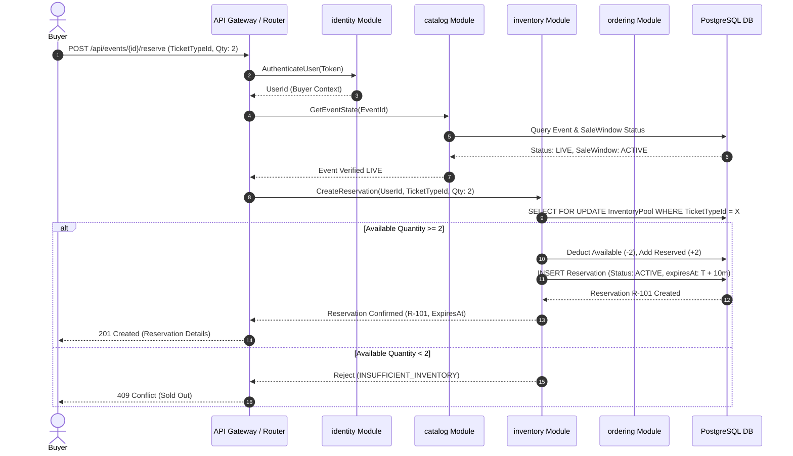

# ADR-001: Modular Monolith Architecture Baseline

* **Status**: Accepted
* **Date**: 2026-09-08
* **Deciders**: Engineering Team
* **Primary Concept**: Architecture decision making & bounded responsibilities

---

## 1. Context & Problem Statement

Launchpad requires an architecture baseline capable of supporting limited-inventory event drops under high concurrency and traffic contention. The engineering team needs a starting system structure that is:
1. **Simple enough to change** as domain rules evolve.
2. **Explicit enough to review** and enforce clear boundary constraints.
3. **Free of operational overhead** during early development phases.

Premature distribution (e.g. microservices, distributed caches, event brokers) adds network latency, eventual consistency complexities, distributed transaction challenges (Saga/2PC), and deployment friction before the core domain boundaries have stabilized.

---

## 2. Decision Outcome

We choose a **Modular Monolith** deployed as a single application binary coupled with a single **PostgreSQL** relational database.

### Core Modules & Responsibilities

The system is partitioned into four decoupled internal modules, each representing a distinct bounded context:

#### 1. `identity`
* **Responsibility**: User registration, authentication, actor context (Buyer, Organizer), and permission validation.
* **Owned Data**: Users, Roles, User Credentials.

#### 2. `catalog`
* **Responsibility**: Event definition, ticket tier (`TicketType`) creation, pricing, venue details, and sale window management (`DRAFT`, `SCHEDULED`, `LIVE`, `ENDED`, `CANCELLED`).
* **Owned Data**: Events, TicketTypes, SaleWindows.

#### 3. `inventory`
* **Responsibility**: Real-time capacity accounting (`Available`, `Reserved`, `Sold`), reservation holds, and automatic TTL expiration reclamation.
* **Owned Data**: InventoryPools, Reservations.

#### 4. `ordering`
* **Responsibility**: Commercial checkout workflow, order state management (`PENDING_PAYMENT`, `PAID`, `EXPIRED`, `CANCELLED`, `REFUNDED`), payment gateway interaction, and ticket entitlement issuance.
* **Owned Data**: Orders, OrderLineItems, Issued Tickets.

---

## 3. Dependency Rules & Boundary Constraints

To maintain modularity within a single codebase:
1. **Acyclic Module Hierarchy**: Dependencies must flow in a single direction:
   $$\text{ordering} \longrightarrow \text{inventory} \longrightarrow \text{catalog} \longrightarrow \text{identity}$$
2. **Forbidden Backward Dependencies**: `inventory` MUST NEVER call `ordering`. `catalog` MUST NEVER call `ordering` or `inventory`.
3. **Database Isolation**: Direct cross-module SQL joins or direct access to another module's database tables are strictly forbidden. All cross-module interactions must pass through public, in-process module service interfaces.
4. **Shared Data Types**: Modules communicate using immutable Value Objects or Primitive DTOs; entity references are never leaked across module boundaries.

---

## 4. Traceability & Paper Review: "Reserve Ticket" Workflow

The sequence diagram below traces how a ticket reservation request moves cleanly across module boundaries without violating dependency rules:

---

## 5. Rejected Alternatives & Defense of "Intentionally Boring"

| Alternative | Rejection Reason / Defense |
| :--- | :--- |
| **Microservices Architecture** | **Rejected**. Introduces network RPC overhead, partial failure handling, distributed transaction complexity (Sagas), complex CI/CD, and operational friction. A modular monolith provides identical code boundaries with zero network latency and ACID database transactions. |
| **Redis (Cache / Distributed Lock)** | **Rejected for now**. PostgreSQL row-level locks (`SELECT FOR UPDATE`) and transactional constraints provide explicit, ACID-compliant concurrency guarantees. Adding Redis introduces cache invalidation bugs and dual-write state drift. |
| **Kafka / Message Broker** | **Rejected for now**. In-process event dispatching or DB-backed transactional outbox is sufficient. Message queues introduce out-of-order delivery, duplicate processing, and extra cluster management before volume requires it. |

> **ADVANCEMENT GATE DEFENSE**:
> Being "intentionally boring" means using proven, simple building blocks—a single compiled binary and PostgreSQL. This allows the team to spend 100% of engineering bandwidth on refining complex domain rules (inventory race conditions, expiration timeouts, event cancellation cascades) instead of debugging distributed systems infrastructure.

---

## 6. Consequences & Revisit Triggers

### Positive Consequences
* Single repository, single build pipeline, zero network IPC latency between modules.
* Atomic, multi-table database transactions simplify state transitions.
* Easy local setup (`docker compose up`) and instant integration testing.

### Negative Consequences / Trade-offs
* All modules share the same CPU/Memory execution instance.
* A runtime panic or unhandled memory fault in one module can crash the binary process.

### Revisit Triggers (When to consider split)
1. **DB Write Bottleneck**: When row contention on PostgreSQL cannot be resolved by sharding/partitioning or read-replicas.
2. **Team Scaling**: When 5+ independent engineering teams struggle with git merge contention on the single monolith repository.
3. **Independent Blast Radius**: When the `inventory` module requires $100\times$ auto-scaling during a high-profile drop while `catalog` remains idle.

---

## 7. Review Questions Answered

### Q1: What future pressure would justify extracting a service?
* **Answer**: Extreme, asymmetric traffic scale on the `inventory` reservation hot path during drop events. If processing 50,000 reservation attempts/sec exhausts CPU/memory resources that degrade the `catalog` or `identity` read paths, extracting `inventory` into a standalone high-throughput service is justified.

### Q2: Where could accidental cyclic dependencies appear?
* **Answer**: Between `ordering` and `inventory`.
  * *Accidental Flow*: `ordering` calls `inventory` to validate/fulfill reservations $\rightarrow$ `inventory` tries to call `ordering` to check order payment status before releasing expired inventory.
  * *Prevention*: `inventory` MUST only manage reservation TTL status (`ACTIVE`, `EXPIRED`, `FULFILLED`) strictly based on inputs received from `ordering`, never by calling back into `ordering`.
