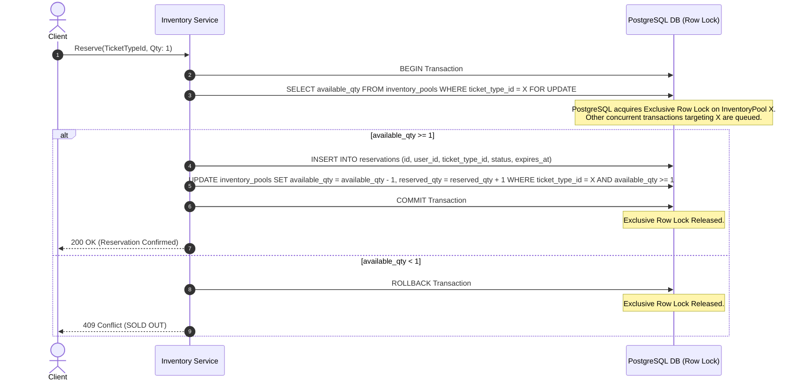

# ADR-002: Inventory Concurrency Control & Atomic Reservations

* **Status**: Accepted
* **Date**: 2026-09-08
* **Deciders**: Engineering Team
* **Primary Concept**: Concurrency Control, ACID Isolation, Row-Level Locking

---

## 1. Context & Problem Statement

In **LAB-201**, we empirically demonstrated that naive (un-locked) application-level Read-Modify-Write reservation logic results in severe **Lost Update / Write Skew Anomalies** under concurrent execution. When 100 users competed for 1 ticket, **97 users were granted fake confirmations** because all 97 read a stale snapshot (`available_qty = 1`) before any write committed.

Launchpad requires an inventory reservation mechanism that guarantees:
1. **Zero Overselling**: Under no circumstances can total reservations exceed configured capacity.
2. **ACID Correctness**: Exact status reporting (`200 Success` vs `409 Sold Out`).
3. **High Performance**: Low transaction hold times and minimal lock contention.

---

## 2. Comparison of Concurrency Control Options

| Concurrency Mechanism | SQL / Architecture Pattern | Pros | Cons / Trade-offs | Verdict |
| :--- | :--- | :--- | :--- | :--- |
| **1. Pessimistic Row Locking (`SELECT FOR UPDATE`)** | `BEGIN;` `SELECT available_qty FROM inventory_pools WHERE id = X FOR UPDATE;` `UPDATE ...;` `COMMIT;` | Guarantees strict serialization per row. Prevents stale reads. Simple, deterministic ACID semantics. | Blocks competing transactions on the exact same row during the lock window. | **SELECTED (Primary)** |
| **2. Optimistic Concurrency Control (OCC / Versioning)** | `UPDATE inventory_pools` `SET available_qty = available_qty - 1, version = version + 1` `WHERE id = X AND version = @readVersion` | Non-blocking reads. Excellent for low/medium contention write workloads. | Under high contention (100+ requests racing for 1 row), 99 transactions abort and require application-level retry loops, causing CPU spinning. | **REJECTED for high-drop inventory** |
| **3. Atomic Conditional SQL Update** | `UPDATE inventory_pools` `SET available_qty = available_qty - 1` `WHERE id = X AND available_qty >= 1` | Single atomic SQL statement executed inside DB kernel. Extremely fast. | Difficult to construct multi-table aggregate state (e.g. creating a `Reservation` row and checking user quotas in the same atomic step). | **SELECTED (As Secondary Guard)** |

---

## 3. Decision Outcome

We select **Pessimistic Row Locking (`SELECT FOR UPDATE`)** combined with **Atomic Conditional Guards (`WHERE available_qty >= X`)** inside a single PostgreSQL database transaction.

### Operational Sequence:

---

## 4. Consequences & Review Questions Answered

### Q1: What lock duration exists?
* **Answer**: The exclusive row-level lock is acquired when `SELECT ... FOR UPDATE` executes and is held strictly until `COMMIT` or `ROLLBACK`. In our implementation, because the transaction only performs in-memory arithmetic and two fast indexed SQL operations (`INSERT reservation`, `UPDATE inventory`), the lock duration is **under 1 to 3 milliseconds**.

### Q2: What is the throughput trade-off?
* **Answer**: Pessimistic locking serializes concurrent transactions on the exact same row (ticket tier). A single PostgreSQL database core can process ~2,000 to 5,000 serial row lock commits per second per row. For a flash drop, this bounds single-tier reservation throughput to ~3,000 requests/sec. (If higher throughput is needed in future labs, we can partition inventory into multiple sub-pools or use Redis token buckets).

### Q3: What happens under deadlock?
* **Answer**: Deadlocks occur when two transactions try to lock multiple resources in opposite orders (e.g., Tx 1 locks Tier A then Tier B; Tx 2 locks Tier B then Tier A).
  * *Mitigation*:
    1. **Strict Lock Ordering**: Always acquire locks in alphabetical order of `ticket_type_id`.
    2. **PostgreSQL Deadlock Detector**: If a cycle occurs, PostgreSQL's deadlock detector (`deadlock_timeout = 1s`) automatically aborts one transaction with error code `4P01` (deadlock detected), allowing the application to safely return a retryable error.

---

## 5. ADVANCEMENT GATE DEFENSE

> **Defensibility**:
> Choosing Pessimistic Row Locking (`SELECT FOR UPDATE`) with atomic SQL guards provides absolute mathematical guarantees against overbooking. It leverages PostgreSQL's native ACID engine as the single source of truth for concurrency coordination, requiring zero external caching infrastructure (like Redis) while maintaining sub-5ms transaction latency.
