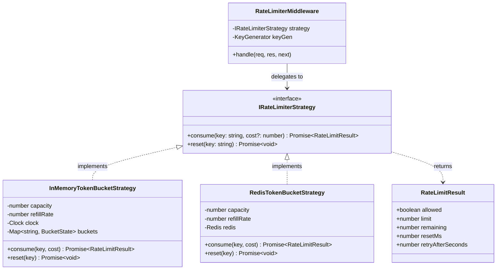

# ADR-004: Rate Limiter Architecture, Token Bucket Strategy & Multi-Instance Enforcement
**Sprint 6: Traffic Protection — Stateless Scale-Out & Rate Limiting (LAB-602)**
**Status:** ACCEPTED
**Date:** September 8, 2026

---

## 1. Context & Threat Model
High-demand event drops (e.g. Coldplay, Taylor Swift) attract automated scalper bots, credential-stuffing attacks, and aggressive fan refreshing. Without rate limiting:
1. Malicious or poorly-written scripts can consume 100% of Node.js event-loop capacity.
2. The atomic reservation transaction boundary (`SELECT FOR UPDATE`) can be subjected to unbounded lock contention.
3. Legitimate human users are starved of access.

We need a flexible rate limiting architecture that can enforce quotas across User IDs, IPs, and endpoints, support multiple algorithms via the **Strategy Pattern**, and enforce quotas consistently across horizontally scaled application instances.

---

## 2. Decision: Token Bucket via Strategy Pattern with Redis Lua
We adopt the **Strategy Pattern** with an atomic **Redis Token Bucket** implementation.

### A. LLD Strategy Pattern Diagram



---

## 3. Mathematical Mechanics of the Token Bucket Algorithm

The Token Bucket algorithm models a bucket of fixed capacity $C$ that continuously fills with tokens at a steady refill rate $r$ (tokens per second):

$$Tokens_{\text{current}} = \min\left(C, Tokens_{\text{stored}} + \Delta t \times r\right)$$

Where:
- $C = \text{Capacity}$ (Maximum allowable burst size).
- $r = \text{Refill Rate}$ (Replenishment speed in tokens per second).
- $\Delta t = t_{\text{now}} - t_{\text{last\_updated}}$ (Elapsed time since last token consumption).

### Evaluation Logic (Atomic Redis Lua Script):
1. **Compute Available Tokens**:
   Calculate refilled tokens based on $\Delta t$. Clamp to $C$.
2. **Evaluate Consumption**:
   - If $Tokens_{\text{current}} \ge Cost$:
     - Deduct cost: $Tokens_{\text{new}} = Tokens_{\text{current}} - Cost$.
     - Return `allowed = true`, `remaining = Tokens_{\text{new}}`.
   - If $Tokens_{\text{current}} < Cost$:
     - Request is throttled!
     - Compute Deficit: $Deficit = Cost - Tokens_{\text{current}}$.
     - Compute Wait Time: $RetryAfter = \left\lceil \frac{Deficit}{r} \right\rceil$ seconds.
     - Return `allowed = false`, `retryAfterSeconds = RetryAfter`.

---

## 4. Standard HTTP 429 Error & Header Envelope

When rate limiting is enforced, the API emits standard RFC / IETF RateLimit headers:
- `X-RateLimit-Limit`: Bucket capacity $C$.
- `X-RateLimit-Remaining`: Tokens currently remaining in the bucket.
- `X-RateLimit-Reset`: Unix epoch timestamp (seconds) when the bucket will fully replenish.

When throttled, the API sets:
- HTTP Status: `429 Too Many Requests`
- Header: `Retry-After: {seconds}`
- Body Envelope:
```json
{
  "error": {
    "code": "RATE_LIMIT_EXCEEDED",
    "message": "Too many requests. Please retry after 2 seconds.",
    "retryAfterSeconds": 2
  }
}
```

---

## 5. Architectural Review Questions

### Question 1: Why the Token Bucket algorithm?
| Algorithm | Burst Handling | Memory Overhead | Smoothness | Best Used For |
|---|---|---|---|---|
| **Fixed Window** | Vulnerable to $2\times$ burst at window boundaries. | Minimal (Single counter). | Choppy / step-wise. | Basic coarse API rate limits. |
| **Sliding Window Log** | Perfect accuracy. | **Extremely High** (Stores a timestamp per request in Redis ZSET). | Completely smooth. | Low-volume, high-precision security endpoints. |
| **Leaky Bucket** | **Rejects bursts** (forces constant output rate). | Minimal. | Perfectly smooth. | Outbound queue throttling, third-party payment gateways. |
| **Token Bucket** *(Chosen)* | **Supports instantaneous bursts up to capacity $C$**, while enforcing steady rate $r$. | **Minimal** (2 floats per key in Redis Hash). | Smooth continuous refill. | **High-demand ticketing APIs & user checkouts.** |

**Why Token Bucket is superior for Launchpad**:
During ticket drops, real users naturally arrive in sudden bursts (e.g. page load + fetching assets + clicking reserve). Token Bucket allows legitimate users to consume a quick burst of 5–10 requests without being blocked, while firmly choking sustained bot flooding down to $r$ requests per second.

### Question 2: Where should enforcement live: edge, app, or both?
**Answer: Both (Defense-in-Depth).**

```
[ Internet Traffic ]
        |
        v
[ Edge / CDN / API Gateway (Cloudflare / AWS WAF) ]  <-- L3/L4 & Coarse L7 (Volumetric DDoS)
        |
        v
[ L7 Load Balancer / Reverse Proxy (Envoy / Nginx) ]
        |
        v
[ Launchpad Backend Application Instances ]           <-- Fine-Grained Domain Quotas
        |
        v
[ Shared Redis Rate Limit Cluster ]
```

1. **Edge Enforcement (WAF / Cloudflare / API Gateway)**:
   - *Role*: Drop volumetric layer 3/4 DDoS attacks, brute-force IP floods, and known malicious botnets **before** they reach application infrastructure.
   - *Limitation*: Edge layer does not understand business semantics (e.g. ticket tier capacity, authenticated VIP status, checkout reservation limits).
2. **Application Enforcement (Launchpad + Redis)**:
   - *Role*: Enforces fine-grained domain policies:
     - User ID quotas across logged-in accounts.
     - Endpoint-specific rules (e.g. `POST /api/reservations` limit = 1 req/sec; `GET /api/events` limit = 20 req/sec).
     - Fraud prevention and bot prevention during ticket claiming.
3. **Verdict**: Volumetric protection belongs at the Edge; business-aware, user-scoped protection belongs inside the Application tier.

---

## 6. Advancement Gate Verification
- [x] **Algorithm Math Explained**: Capacity $C$, refill rate $r$, and fractional replenishment $\Delta t \times r$ documented with KaTeX math.
- [x] **Throttled Client Demonstrated**: Automated test `tests/integration/rate-limiting.spec.ts` proves that a client exceeding quota receives HTTP 429, `Retry-After: 1`, and `RATE_LIMIT_EXCEEDED`.
- [x] **Multi-Instance Shared Enforcement Proven**: Requests alternating between `inst-1` and `inst-2` deduct from the exact same atomic Redis Token Bucket and throttle jointly.
