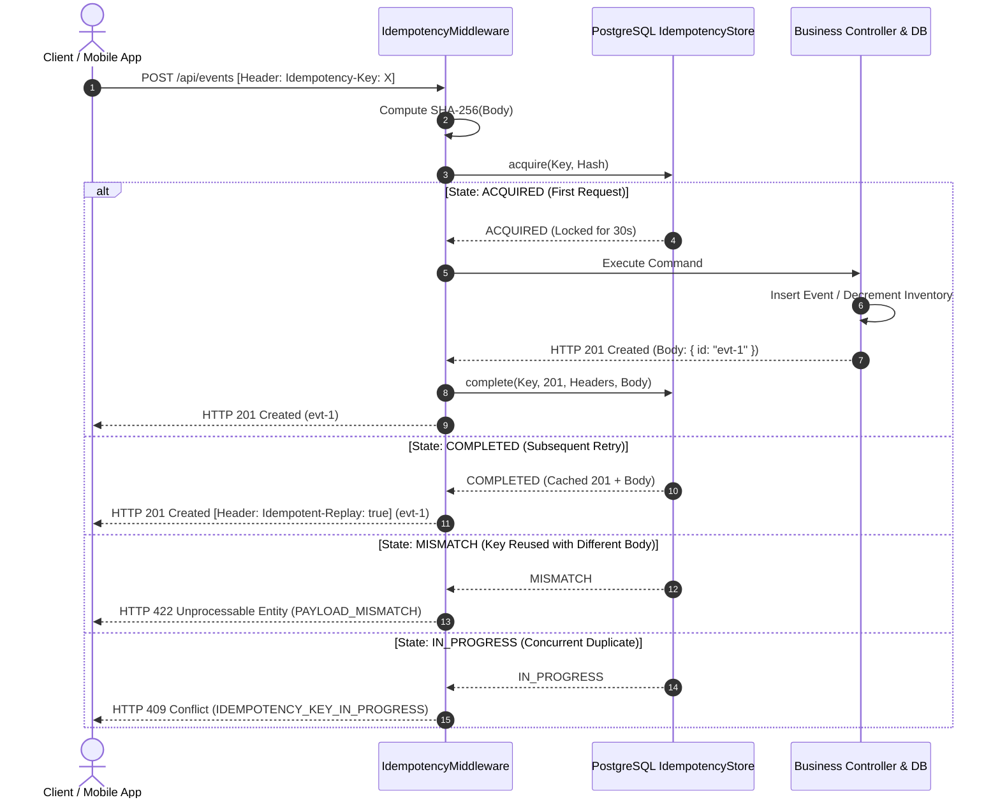

# ADR-005: Idempotency Key Architecture & At-Least-Once Deduplication
**Sprint 7: Idempotency and Retry-Safe API Design (LAB-702)**
**Status:** ACCEPTED
**Date:** September 8, 2026

---

## 1. Context & Problem Statement
Because network boundaries between clients, reverse proxies, and backend instances are inherently **at-least-once**, clients will inevitably retry requests after socket drops or timeouts.

Without an idempotency layer, every client retry of `POST /api/events` or `POST /api/reservations` creates duplicate database entities and double-deducts inventory. We must provide a mechanism where repeated requests with the same business intent return the exact original result without creating duplicate side-effects.

---

## 2. Decision: PostgreSQL-Backed Idempotency Store with SHA-256 Fingerprinting
We implement the **Idempotency Key Pattern** enforced via `Idempotency-Key` HTTP headers and backed by an ACID table in PostgreSQL: `idempotency_keys`.

### A. Idempotency Flow



---

## 3. Storage Architecture: Why PostgreSQL instead of Redis?

| Dimension | PostgreSQL `idempotency_keys` *(Chosen)* | Redis (`SETNX key value`) |
|---|---|---|
| **Durability & ACID** | **Zero Data Loss**: If the node crashes or power fails, committed idempotency records survive with guaranteed persistence. | Vulnerable to eviction or failover window if Redis crashes before persisting. |
| **Atomic Insertion** | `INSERT ... ON CONFLICT (key) DO NOTHING` leverages the primary key B-Tree index for strict serializability. | Handled via `SETNX` or Lua script. |
| **Crash Recovery** | `locked_until TIMESTAMP`: If an app node crashes while `IN_PROGRESS`, the lock expires in 30s, allowing safe retry. | Handled via TTL. |
| **Storage Burden** | Indexed rows with scheduled purge job for keys $> 24$ hours old. | In-memory RAM consumption. |

**Verdict**: Because duplicate financial charges and inventory deductions cause irreversible financial and legal harm, **authoritative idempotency state must reside in PostgreSQL**.

---

## 4. Architectural Review Questions

### Question 1: How long are keys retained?
**Answer: 24 to 72 hours.**

1. **Client Retry Windows**:
   - Automated mobile retries and network reconnection policies operate on orders of seconds to minutes (e.g. up to 15 minutes).
   - Human users whose purchases timed out typically refresh or retry within minutes to hours.
2. **Storage Lifecycle**:
   - Retaining keys forever would bloat the `idempotency_keys` table to millions of rows, slowing down index lookups and wasting disk space.
   - **Production Policy**: Retain keys for **24 hours**. A background vacuum/cleanup job runs daily:
     ```sql
     DELETE FROM idempotency_keys WHERE created_at < NOW() - INTERVAL '24 HOURS';
     ```
   - If a client retries after 24 hours with an expired key, it is treated as a new request.

### Question 2: What data can be replayed safely?
**Answer: The exact HTTP response envelope (Status Code, response JSON, and business identifiers), but NOT transient socket-level headers.**

1. **Safe to Replay**:
   - **Status Code**: `201 Created`, `200 OK`, `400 Bad Request` (Client validation failures are also deterministic and can be cached!).
   - **Business Data**: Resource IDs (`id`), created timestamps, confirmation codes, ticket references.
   - **Content-Type**: `application/json`.
   - **Audit Header**: `Idempotent-Replay: true` (Informs clients and tracing systems that the response was served from the idempotency store without re-executing business logic).
2. **NEVER Replay**:
   - `Date` header (should reflect the current HTTP response delivery time).
   - `Set-Cookie` / Session tokens (may contain expired session state).
   - `X-Correlation-ID` (the retry request's own correlation ID must be preserved for end-to-end tracing).

---

## 5. Advancement Gate Verification
- [x] **Safe Replay Proven**: Automated test `tests/integration/idempotency-workflow.spec.ts` proves that retrying a request returns the cached 201 response with `Idempotent-Replay: true`.
- [x] **Payload Mismatch Rejected**: Reusing the same key with an altered body returns **HTTP 422 `IDEMPOTENCY_KEY_PAYLOAD_MISMATCH`**.
- [x] **Concurrent Retry Storm Tested**: 10 simultaneous requests with the same key generated **exactly 1 row in PostgreSQL** (0% duplicate entities).
