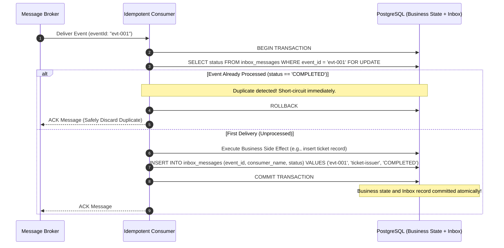

# Architecture Note: Consumer Idempotency & The Inbox Pattern

> **Ticket**: LAB-1003 — Implement idempotent consumer  
> **Concept**: At-least-once delivery, Inbox pattern, deduplication, atomic side-effect boundaries

---

## 1. Context: Why At-Least-Once Demands Idempotence

As proven in **LAB-1002 (Transactional Outbox)**, distributed systems cannot guarantee "exactly-once" delivery over an unreliable network. When an outbox publisher crashes after publishing to the broker but before updating the outbox table, it will inevitably re-publish the message upon restart. Similarly, distributed brokers like Kafka or RabbitMQ redeliver unacknowledged messages after consumer timeouts.

Therefore:
$$\text{Transactional Outbox (At-Least-Once Delivery)} + \text{Idempotent Consumer (Deduplication)} = \text{Effectively-Once Processing}$$

---

## 2. Implementation: The Inbox Pattern

The **Inbox Pattern** provides a persistent deduplication boundary for asynchronous consumers.

---

## 3. Atomic Side Effect Execution

### Scenario A: Relational Database Side Effect
When the consumer's action modifies database state (e.g., creating a digital ticket or updating inventory):
- The business update and the `inbox_messages` insert occur inside the **exact same database transaction**.
- If the application crashes during the business update, the entire transaction rolls back—including the inbox record. When the broker redelivers the event, the consumer retries cleanly from scratch.

### Scenario B: External Non-Transactional Side Effect (Email / Push Notification / Third-Party API)
When the consumer's action is an external API call:
- The consumer writes an inbox row with `status = 'PROCESSING'`.
- The consumer passes the `eventId` to the external service as an **external idempotency key** (e.g. `Idempotency-Key: evt-001` to SendGrid or Stripe).
- Upon receiving the external response, the consumer updates status to `'COMPLETED'`.

---

## 4. Review Question: Could Natural Business Keys Replace an Inbox Table?

### The Short Answer:
**Yes, in many cases, natural business keys with unique constraints are superior to a synthetic inbox table.**

### When to Use Natural Business Keys:
If the domain model inherently enforces a 1:1 relationship with the event, a database constraint accomplishes deduplication with zero extra tables:
- Example: An event `OrderConfirmed` generates digital tickets. A database table `ticket_entitlements` with a unique constraint on `UNIQUE(order_id)` will automatically reject duplicate insertions with a PostgreSQL `23505 unique_violation`. The consumer simply treats conflict errors as successful duplicates.

### When an Inbox Table IS Required:
1. **Multi-Consumer Subscriptions**: Multiple independent consumers (e.g. `analytics-indexer`, `email-notifier`, `ticket-generator`) subscribe to the same `OrderConfirmed` event. Each consumer needs its own independent deduplication tracking (`PRIMARY KEY (event_id, consumer_name)`).
2. **Non-Idempotent Aggregations**: Incrementing counters or appending audit logs where no natural unique key exists.
3. **Auditability & Observability**: An inbox table provides a queryable timeline of exactly when each consumer processed each event.
