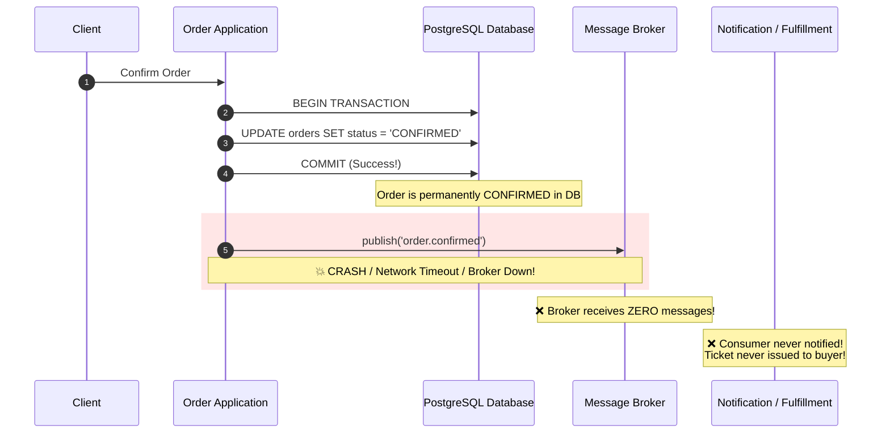
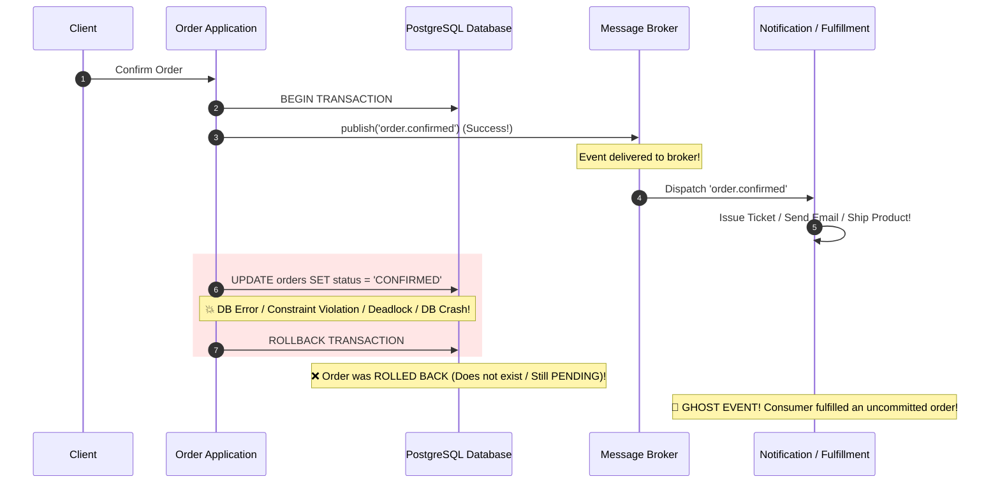

# Dual-Write Failure: Atomicity Boundary & Failure Modes

> **Ticket**: LAB-1001 — Reproduce dual-write failure  
> **Concept**: Dual-write inconsistency, distributed transaction boundaries, at-least-once foundations

---

## 1. The Core Problem: The Dual-Write Dilemma

In an event-driven architecture, when a state change occurs in a business application (e.g., an order is confirmed), two distinct operations must succeed together:
1. **Database Update**: Persist the new entity state (e.g. `UPDATE orders SET status = 'CONFIRMED'`) into a relational database (PostgreSQL).
2. **Event Publication**: Publish a fact (e.g. `order.confirmed`) to a distributed message broker (Kafka, RabbitMQ, Redis Pub/Sub) so downstream microservices (Notifications, Fulfillment, Analytics) can react.

Because a relational database and an external message broker are **two separate, distributed network resources**, they cannot participate in a single ACID transaction without expensive and brittle Two-Phase Commit (2PC / XA) protocols—which are unsupported by modern message brokers like Kafka or Redis.

Consequently, developers are forced to write naive code with two distinct network operations:
```typescript
// NAIVE DUAL WRITE PATTERN (ANTI-PATTERN)
await db.query("UPDATE orders SET status = 'CONFIRMED' WHERE id = $1", [orderId]);
await messageBroker.publish('order.confirmed', event);
```

---

## 2. Failure Mode 1: Post-Commit Crash (Lost Event / Silent Inconsistency)

In this scenario, the application commits state to the database, but encounters a failure before or during message publication (e.g., process crash, network partition to broker, broker unreachable, node OOM killed):



### Consequences:
- The customer's credit card was charged and the database shows the order is confirmed.
- Downstream systems never receive the event. Tickets are never issued, notifications are never sent, and warehouse inventory is never allocated.
- **Why simple retry alone is tricky**: If the application crashed or was killed, there is no in-memory process left to retry the publish. The event is permanently lost unless a manual database audit is performed.

---

## 3. Failure Mode 2: Publish-Before-Commit (Ghost Event Inconsistency)

Some engineers attempt to fix Failure Mode 1 by publishing to the broker *before* committing the database transaction:

```typescript
// INVERTED DUAL WRITE (EQUALLY DANGEROUS)
await messageBroker.publish('order.confirmed', event);
await db.query("UPDATE orders SET status = 'CONFIRMED' WHERE id = $1", [orderId]);
```



### Consequences:
- The broker accepted the event, and downstream consumers immediately started fulfilling the order (issuing tickets or shipping physical goods).
- Meanwhile, PostgreSQL failed to commit (deadlock, constraint violation, or server crash) and rolled back the transaction.
- Downstream systems acted on a **phantom state that never legally existed in the system of record**.

---

## 4. Review Questions & Advancement Gate

### Q1: Why can retrying publish alone be tricky?
1. **Process Death**: If the server hosting the application encounters an Out-Of-Memory (OOM) error, power loss, or container restart between commit and publish, in-memory retry loops are completely wiped out.
2. **Ambiguous Network Failures**: If the publish call times out, the broker might have received the message (connection dropped while reading the ACK). Retrying the publish creates duplicate events on the broker.
3. **Poison State**: If the network to the broker is down for 15 minutes, holding in-memory retry queues exhausts application memory and eventually crashes the process.

### Q2: What is the atomicity boundary precisely?
The atomicity boundary in relational databases is **strictly limited to a single database transaction on a single database connection**.
- External side effects (HTTP calls, message broker publishes, third-party emails) **cannot participate** in a relational database transaction.
- Therefore, the only way to achieve atomic messaging without distributed transactions is the **Transactional Outbox Pattern (LAB-1002)**: persist the event as a row in an `outbox_messages` table inside the *exact same* database transaction that updates the domain entity.
