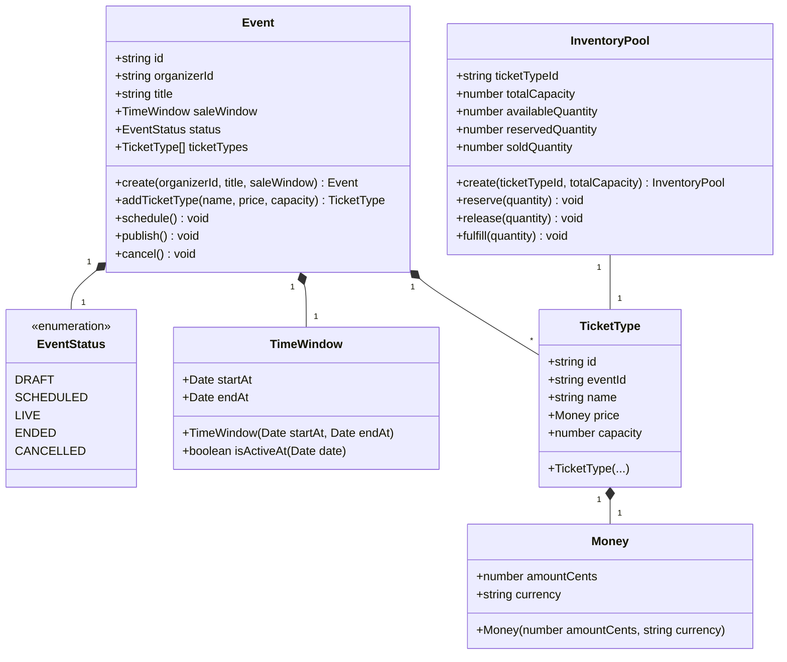

# Low-Level Design (LLD): Catalog & Event Module

## 1. Class & Module Architecture

---

## 2. Explicit Domain Rule Table

| Rule ID | Aggregate / Entity | Domain Invariant | Enforcement Mechanism | Thrown Exception |
| :--- | :--- | :--- | :--- | :--- |
| **RULE-101** | `TimeWindow` | `startAt` must be strictly before `endAt` ($\text{startAt} < \text{endAt}$). | Constructor check inside `TimeWindow` Value Object. | `InvalidTimeWindowError` |
| **RULE-102** | `Money` | Price amount must be a non-negative integer ($\text{amount} \ge 0$). | Constructor check inside `Money` Value Object. | `InvalidMoneyError` |
| **RULE-103** | `TicketType` | Initial capacity must be greater than zero ($\text{capacity} > 0$). | Entity constructor / factory method validation. | `InvalidCapacityError` |
| **RULE-104** | `Event` | Cannot transition to `SCHEDULED` or `LIVE` without at least one `TicketType`. | `schedule()` and `publish()` methods on `Event`. | `EmptyTicketTypesError` |
| **RULE-105** | `Event` | Invalid state machine transitions (e.g. `DRAFT` $\rightarrow$ `LIVE` directly, `CANCELLED` $\rightarrow$ `LIVE`) are blocked. | Explicit status check inside transition methods. | `InvalidStateTransitionError` |
| **RULE-106** | `InventoryPool` | $\text{Available} + \text{Reserved} + \text{Sold} = \text{Total Capacity}$. | `reserve()` / `release()` / `fulfill()` aggregate methods. | `InsufficientInventoryError` |
