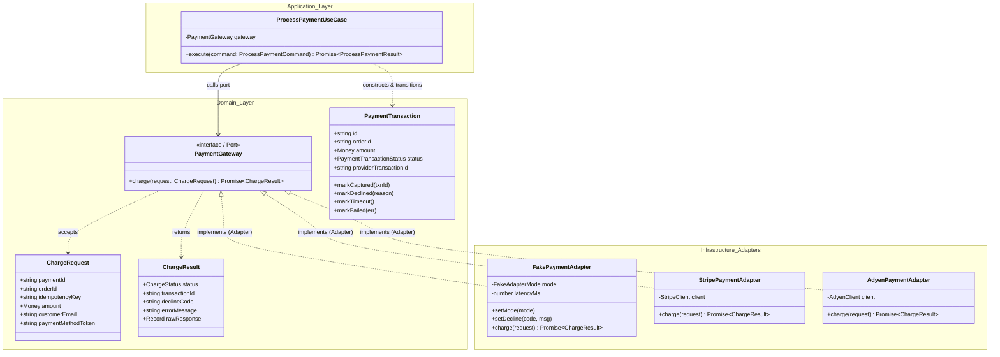

# LLD: Ports and Adapters (Hexagonal Architecture) for External Payments
**Sprint 8: Payments, Adapters and Workflow Compensation (LAB-801)**
**Status:** COMPLETED
**Date:** September 8, 2026

---

## 1. Executive Summary & Design Rationale
In event ticketing and flash-drop systems, external payment gateways (e.g. Stripe, Adyen, Razorpay, PayPal) introduce uncontrollable latency, network dropped connections, and changing vendor SDK APIs.

If domain entities or order use cases import vendor SDKs directly (e.g. `import Stripe from 'stripe'`), the core business logic becomes tightly coupled to third-party data contracts, making automated testing slow, flaky, and expensive.

Under **Hexagonal Architecture (Ports and Adapters)**:
1. The **Core Domain** defines a pure, vendor-agnostic interface (the **Port**: `PaymentGateway`).
2. Third-party providers are isolated behind **Adapters** (`FakePaymentAdapter`, `StripePaymentAdapter`) that translate domain requests into vendor API calls and normalize vendor responses back into domain outcomes.
3. The domain depends on abstractions, **never on vendor SDK classes** (Dependency Inversion Principle).

---

## 2. Low-Level Design (LLD) Ports-and-Adapters Diagram

---

## 3. Outcome Mapping: Normalizing Vendor States into Domain States

Every external payment provider uses different terminology for payment results:

| Domain Status (`ChargeStatus`) | Stripe Translation | Adyen Translation | Razorpay Translation | Action in Launchpad Domain |
|---|---|---|---|---|
| **`SUCCESS`** | `status: "succeeded"` | `resultCode: "Authorised"` | `status: "captured"` | Transition reservation to `CONFIRMED`, issue ticket. |
| **`DECLINED`** | `status: "failed"`, `code: "card_declined"` | `resultCode: "Refused"` | `status: "failed"`, `code: "BAD_REQUEST_ERROR"` | Transition payment to `DECLINED`, notify user to try another card. |
| **`TIMEOUT`** | Network socket timeout / `ETIMEDOUT` | HTTP 504 Gateway Timeout | Connection reset | Mark payment `TIMEOUT`, trigger reconciliation or compensation. |
| **`FAILED`** | HTTP 500 / Malformed JSON | `resultCode: "Error"` | System failure | Trigger retry policy or mark order failed. |

---

## 4. Architectural Review Questions

### Question 1: Where does vendor-specific idempotency belong?
**Answer: Strictly INSIDE the Adapter, mapped from the domain idempotency key.**

1. **Vendor Headers Vary**:
   - Stripe expects header: `Idempotency-Key: {key}`.
   - Adyen expects payload property: `reference: {key}`.
   - PayPal expects header: `PayPal-Request-Id: {key}`.
2. **Domain Isolation**:
   - The domain application layer creates a canonical UUID (`idempotencyKey`) representing the payment intent.
   - The `StripePaymentAdapter` maps that domain key to `headers: { 'Idempotency-Key': request.idempotencyKey }`.
   - If the vendor is swapped to Adyen, only the adapter changes; the domain workflow never knows about vendor-specific HTTP headers.

### Question 2: What would make this abstraction too generic?
**Answer: The "Universal Super-API" Anti-Pattern.**

An abstraction becomes dangerously over-generic when it attempts to unify every esoteric capability of all providers into a single leaky interface:
1. **Generic Payload Blobs**:
   - Bad: `charge(options: Record<string, any>): Promise<any>`
   - This destroys compile-time type safety and leaks vendor-specific dictionary keys across the codebase.
2. **Stripping Essential Failure Semantics**:
   - If the port simply returns `boolean` (success/failure) without distinguishing **DECLINED** (card error, do not retry same card) from **TIMEOUT** (ambiguous outcome, requires reconciliation) from **TRANSIENT_ERROR** (safe to retry), the domain cannot make intelligent workflow decisions.
3. **The Sweet Spot**:
   - Our `PaymentGateway` port models only what Launchpad *needs*: `paymentId`, `orderId`, `amount: Money`, `paymentMethodToken`, and `idempotencyKey`, and returns clean domain-discriminated union states (`SUCCESS`, `DECLINED`, `TIMEOUT`, `FAILED`).

---

## 5. Advancement Gate Verification
- [x] **Zero Vendor Dependencies in Core Domain**: `src/modules/payment/domain/` contains zero external vendor SDK imports.
- [x] **Domain-Shaped Port Contract**: `PaymentGateway` models domain `Money` and typed `ChargeResult`.
- [x] **Swappable Adapters Proven**: Automated test `tests/unit/FakePaymentAdapter.spec.ts` proves that `ProcessPaymentUseCase` swaps from `FakePaymentAdapter` to `MockStripeAdapter` with zero domain code modifications.
