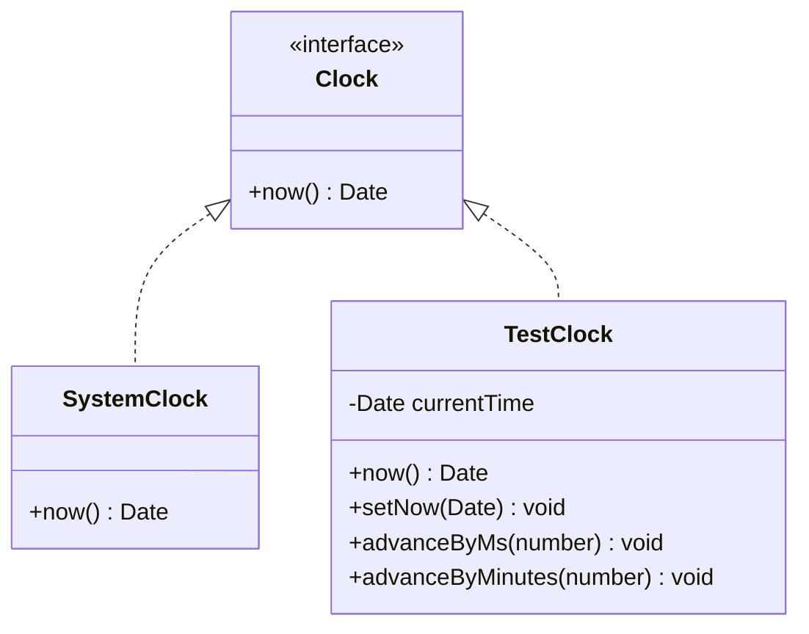

# Low-Level Design (LLD) Note: State Pattern vs. Enum + Transition Table

## 1. Architectural Question
*When modeling stateful domain entities (like `Reservation`), should we implement the classic Gang of Four (GoF) **State Pattern** (with polymorphic State classes) or is an **Enum + Transition Table** inside the entity aggregate sufficient?*

---

## 2. Comparison Matrix

| Dimension | GoF State Pattern (Class Hierarchy) | Enum + Transition Table in Aggregate |
| :--- | :--- | :--- |
| **Structure** | `interface ReservationState` `PendingState implements ReservationState` `ConfirmedState implements ReservationState` `ExpiredState implements ReservationState` | `enum ReservationStatus` Methods on `Reservation` aggregate checking `this._status`. |
| **Boilerplate / Ceremony** | High. Requires separate classes for every state, factory methods to instantiate states, and circular references (`state.context`). | Very Low. Self-contained in a single aggregate entity file (`Reservation.ts`). |
| **State-Dependent Behavior** | Ideal when each state has radically distinct business behavior and algorithms. | Ideal when state transitions primarily validate lifecycle gating and time boundaries. |
| **Persistence / ORM Mapping** | Complex. Storing polymorphic state objects in PostgreSQL requires converting back and forth to a string or discriminator column. | Trivial. Stored directly as a single `VARCHAR` column in PostgreSQL (`status VARCHAR(50)`). |
| **Explicitness of Matrix** | Diffuse. Transition rules are scattered across 4+ separate class files. | Concentrated. All transitions and rules are readable in one place. |

---

## 3. Review Questions Answered

### Q1: Do we need State classes or is a transition table enough?
* **Answer**: An **Enum + Transition Table directly encapsulated within the `Reservation` aggregate is the superior choice for our system**.
* **Reasoning**:
  1. The `Reservation` lifecycle consists of simple, discrete state transitions with clear time guards (`clock.now() <= expiresAt`).
  2. The entity does not exhibit radically diverging polymorphous behavior across states (e.g. it doesn't change calculation algorithms or UI rendering methods).
  3. Storing and reconstructing state from PostgreSQL is clean and free of ORM impedance mismatch.
  4. Unit testing the full $4 \times 4$ transition matrix can be done exhaustively in a single concise spec file.

### Q2: What future complexity would justify the full GoF State Pattern?
* **Answer**: The full GoF State Pattern would be justified if:
  1. **Dynamic State-Specific Actions**: If `PENDING` states need complex background retry timers, `CONFIRMED` states require dynamic QR code generation algorithms and wallet pass signatures, and `EXPIRED` states trigger secondary auction mechanisms.
  2. **Plug-and-Play Extensibility**: If third-party plugins or tenants need to introduce custom lifecycle states without modifying core aggregate code.
  3. **Multi-Step Hierarchical States**: If states contain nested sub-states (e.g., `PENDING_AWAITING_PAYMENT_METHOD` vs `PENDING_3DS_CHALLENGE`).

---

## 4. Clock Abstraction Rationale

* **Why an injectable Clock is mandatory**:
  Real-world systems must handle 10-minute expiration windows. Without a `Clock` abstraction, automated unit tests would have to use `setTimeout()` and sleep for 10 real minutes to verify expiration logic!
  With `TestClock`, tests run in **30 milliseconds** by advancing time deterministically (`clock.advanceByMinutes(11)`).
