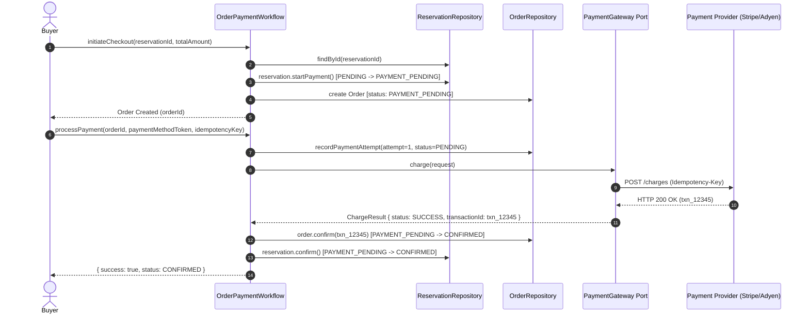

# Payment Workflow Sequence Diagrams (LAB-802)

## 1. Happy Path: Reservation Hold to Payment Confirmation



---

## 2. Recoverable Decline Flow: Retry with Alternate Card

```mermaid
sequenceDiagram
    autonumber
    actor Buyer
    participant OrderModule as OrderPaymentWorkflow
    participant ResRepo as ReservationRepository
    participant OrderRepo as OrderRepository
    participant Gateway as PaymentGateway Port
    participant Provider as Payment Provider

    Note over Buyer, Provider: Attempt 1: Insufficient Funds
    Buyer->>OrderModule: processPayment(orderId, card_declined_token, key_1)
    OrderModule->>Gateway: charge(...)
    Gateway->>Provider: POST /charges
    Provider-->>Gateway: Card Declined (insufficient_funds)
    Gateway-->>OrderModule: ChargeResult { status: DECLINED }
    
    OrderModule->>OrderRepo: order.markPaymentDeclined() [PAYMENT_DECLINED]
    OrderModule->>ResRepo: reservation.revertPaymentDecline() [PAYMENT_PENDING -> PENDING]
    OrderModule-->>Buyer: { success: false, recoverable: true, reason: "insufficient_funds" }

    Note over Buyer, Provider: Reservation hold is PRESERVED; Buyer retries with new card
    Buyer->>OrderModule: processPayment(orderId, valid_card_token, key_2)
    OrderModule->>OrderRepo: order.retryPayment() [PAYMENT_DECLINED -> PAYMENT_PENDING]
    OrderModule->>Gateway: charge(...)
    Gateway->>Provider: POST /charges
    Provider-->>Gateway: Approved (txn_retry_success)
    Gateway-->>OrderModule: ChargeResult { status: SUCCESS }
    
    OrderModule->>OrderRepo: order.confirm(txn_retry_success) [CONFIRMED]
    OrderModule->>ResRepo: reservation.confirm() [CONFIRMED]
    OrderModule-->>Buyer: { success: true, status: CONFIRMED }
```

---

## 3. Duplicate Provider Webhook Replay (Idempotency)

```mermaid
sequenceDiagram
    autonumber
    participant Provider as Payment Provider
    participant OrderModule as OrderPaymentWorkflow
    participant OrderRepo as OrderRepository
    participant ResRepo as ReservationRepository

    Note over Provider, OrderModule: Webhook Delivery 1
    Provider->>OrderModule: handlePaymentWebhook(event_001, orderId, txn_123, SUCCESS)
    OrderModule->>OrderRepo: order.confirm(txn_123) [CONFIRMED]
    OrderModule->>ResRepo: reservation.confirm() [CONFIRMED]
    OrderModule-->>Provider: HTTP 200 OK (CONFIRMED)

    Note over Provider, OrderModule: Webhook Delivery 2 (Network Retry / At-Least-Once Delivery)
    Provider->>OrderModule: handlePaymentWebhook(event_001, orderId, txn_123, SUCCESS)
    OrderModule->>OrderModule: Check processedWebhookEvents (event_001 exists)
    OrderModule-->>Provider: HTTP 200 OK { outcome: DUPLICATE_IGNORED, status: CONFIRMED }

    Note over OrderModule, ResRepo: Zero extra database writes; zero duplicate inventory deductions
```

---

## 4. Advancement Gate: Ambiguous Timeout + Late Success After Expiration

```mermaid
sequenceDiagram
    autonumber
    actor Buyer
    participant OrderModule as OrderPaymentWorkflow
    participant ResRepo as ReservationRepository
    participant ExpiryService as ReservationExpiryScanner
    participant Provider as Payment Provider

    Note over Buyer, Provider: Step 1: Client times out waiting for upstream payment provider
    Buyer->>OrderModule: processPayment(orderId, token, key_timeout)
    OrderModule->>Provider: charge(...) [Socket hangs / Gateway Timeout]
    Provider--xOrderModule: [Timeout]
    OrderModule-->>Buyer: { status: PAYMENT_PENDING, timeout: true }

    Note over ExpiryService, ResRepo: Step 2: 10 minutes pass; Reservation TTL expires
    ExpiryService->>ResRepo: Scanner finds expired reservation [PENDING -> EXPIRED]
    ExpiryService->>ResRepo: Return tickets back to available_qty inventory pool

    Note over Provider, OrderModule: Step 3: 5 minutes later, Provider sends asynchronous SUCCESS webhook
    Provider->>OrderModule: handlePaymentWebhook(event_late_999, orderId, txn_late, SUCCESS)
    OrderModule->>ResRepo: findById(reservationId)
    Note over OrderModule: Detected reservation.status == EXPIRED!
    Note over OrderModule: INVENTORY INVARIANT: Cannot confirm order; seats may be resold!
    
    OrderModule->>OrderModule: order.markRefundRequired(txn_late, "Reservation expired")
    OrderModule->>Provider: Initiate Automated Refund / Compensation (refund_txn_late)
    OrderModule-->>Provider: HTTP 200 OK { outcome: REFUND_TRIGGERED, status: REFUND_REQUIRED }

    Note over OrderModule: Invariant Protected: ZERO OVERSELL. Order is NOT confirmed.
```

---

## 5. Review Questions Answered

### Question 1: Who owns workflow state?
**Answer**: The **`OrderPaymentWorkflow` Application Service (Order Aggregate / Saga Orchestrator)** owns the workflow state.
- External payment gateways only know about charges, payments, and payment intents. They have no concept of limited-ticket pools, seat locks, or TTL expiration.
- Inventory reservations only know about temporal holds and capacity counts.
- Therefore, the commercial **Order** aggregate acts as the state anchor that coordinates reservation validity, payment attempt logs, and final fulfillment or compensation triggers.

### Question 2: What if provider says success after local timeout?
**Answer**:
1. If the local checkout experienced a timeout, the order is left in `PAYMENT_PENDING` (awaiting asynchronous resolution).
2. When the provider webhook arrives with `SUCCESS`:
   - **Case A (Reservation still valid)**: If `clock.now() <= reservation.expiresAt` and reservation is still held, the workflow transitions `Order -> CONFIRMED` and `Reservation -> CONFIRMED`.
   - **Case B (Reservation already expired & released)**: If the reservation reached its TTL and was swept by the background expiry scanner, its capacity was returned to `available_qty` and potentially purchased by someone else. In this scenario, confirming the order would cause an **illegal oversell**. The workflow transitions `Order -> REFUND_REQUIRED` and immediately initiates a compensating refund transaction. Contradictory state is strictly prevented.
