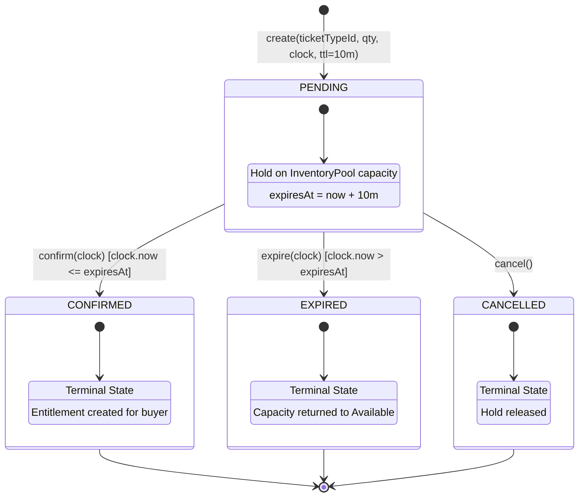

# Reservation State Machine Diagram

## 1. State Diagram

---

## 2. Transition Matrix Table

| Current State | Target State | Trigger Operation | Preconditions / Guard Rules | Postconditions / Side Effects |
| :--- | :--- | :--- | :--- | :--- |
| **`[*]` (None)** | **`PENDING`** | `Reservation.create()` | `qty > 0`, `ticketTypeId` valid | Reservation created with `expiresAt = now + 10m`. |
| **`PENDING`** | **`CONFIRMED`** | `res.confirm(clock)` | `clock.now() <= expiresAt` | Order confirmed; Ticket entitlement issued. |
| **`PENDING`** | **`EXPIRED`** | `res.expire(clock)` | `clock.now() > expiresAt` | Reservation marked expired; Capacity returned to `available_qty`. |
| **`PENDING`** | **`CANCELLED`** | `res.cancel()` | None | Reservation cancelled; Capacity returned to `available_qty`. |
| **`CONFIRMED`** | Any | Any | **FORBIDDEN** | Throws `InvalidStateTransitionError`. |
| **`EXPIRED`** | Any | Any | **FORBIDDEN** | Throws `InvalidStateTransitionError`. |
| **`CANCELLED`** | Any | Any | **FORBIDDEN** | Throws `InvalidStateTransitionError`. |
