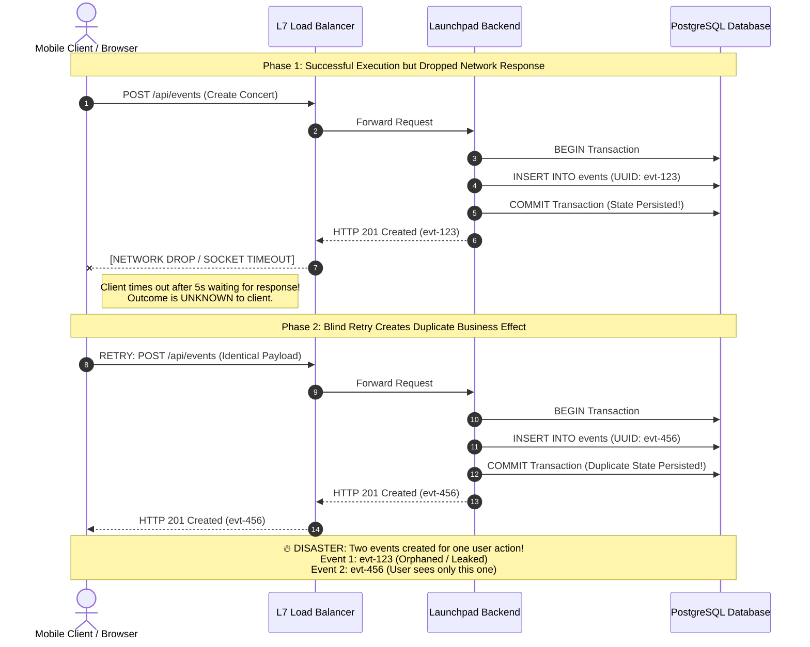

# Retry Failure Sequence: The "Unknown Outcome" Problem
**Sprint 7: Idempotency and Retry-Safe API Design (LAB-701)**
**Status:** COMPLETED
**Date:** September 8, 2026

---

## 1. Executive Summary & Defect Statement
On unreliable mobile and cloud networks, HTTP requests do not simply "succeed" or "fail"; they can enter an **ambiguous indeterminate state** where the client has no way to know whether its command was executed by the server.

In **LAB-701**, we proved this failure mode:
1. A client submits `POST /api/events` (or `POST /api/reservations`).
2. The server receives the request, opens a database transaction, decrements inventory or creates an event, and commits to PostgreSQL.
3. Before the HTTP 201 response reaches the client, a network glitch, TCP socket reset, or client-side timeout occurs.
4. The client catches the timeout exception. Believing the request failed, the client (or automated mobile app retry engine) resends the request.
5. **The Bug**: The server processes the second request as a brand-new intent, creating **two duplicate entities** and charging the user twice.

---

## 2. Retry Failure Sequence Diagram

---

## 3. Review Question: Why can the client not know whether the first request committed?
**Answer: The Fundamental Trilemma of Distributed Systems (Two Generals' Problem).**

When a client sends an HTTP request over a network and encounters a timeout or socket drop, there are **three mutually indistinguishable scenarios**:

| Scenario | Where the Failure Occurred | Did the Server Commit? | Safe to Blindly Retry? |
|---|---|---|---|
| **Scenario A** | Outbound transit: Packet was dropped before reaching the server. | **NO** | YES |
| **Scenario B** | Mid-execution: Server crashed or network severed during DB write. | **NO (Rolled back)** | YES |
| **Scenario C** | Inbound transit: Server executed and committed, but response packet was dropped. | **YES (Committed)** | **NO (Duplicates effect!)** |

Because a TCP socket timeout looks identical to the client in all three scenarios, **the client cannot determine whether Scenario A, B, or C occurred**.

This is why network boundaries are inherently **at-least-once**. Without an explicit deduplication primitive (an Idempotency Key), safe retries are mathematically impossible.

---

## 4. Endpoints Requiring Idempotency in Launchpad

| Endpoint | HTTP Method | Naturally Idempotent? | Needs Idempotency-Key? | Business Risk if Duplicated |
|---|---|---|---|---|
| `GET /api/events/:id` | GET | **YES** | NO | Zero risk (Read-only). |
| `DELETE /api/events/:id` | DELETE | **YES** | NO | Safe (Deleting already deleted item yields 404/204). |
| `PUT /api/events/:id` | PUT | **YES** | NO | Safe (Full replacement of resource). |
| `POST /api/events` | POST | **NO** | **YES** | Duplicate event catalogs, split ticket tiers. |
| `POST /api/reservations` | POST | **NO** | **CRITICAL** | Double inventory deductions, double credit card authorizations! |
| `PATCH /api/events/:id/status` | PATCH | **PARTIAL** | **YES** | Safe if state transition is strict (FSM rejects repeat), but needs key to replay response. |

---

## 5. Advancement Gate Verification
- [x] **"Unknown Outcome" Problem Explained**: Documented why network drop prevents distinguishing pre-commit from post-commit failures.
- [x] **Duplicate Side-Effect Demonstrated**: Automated test `tests/concurrency/duplicate-retry-defect.spec.ts` proves that retrying a post-commit timeout creates two separate events in PostgreSQL.
