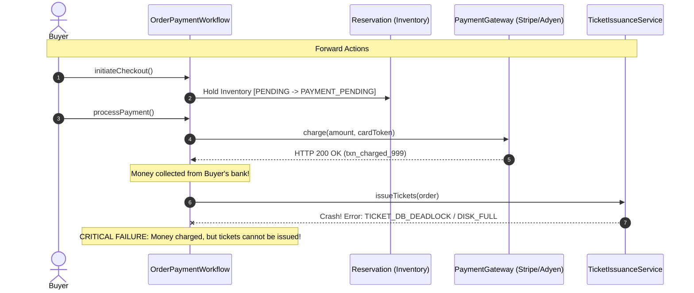
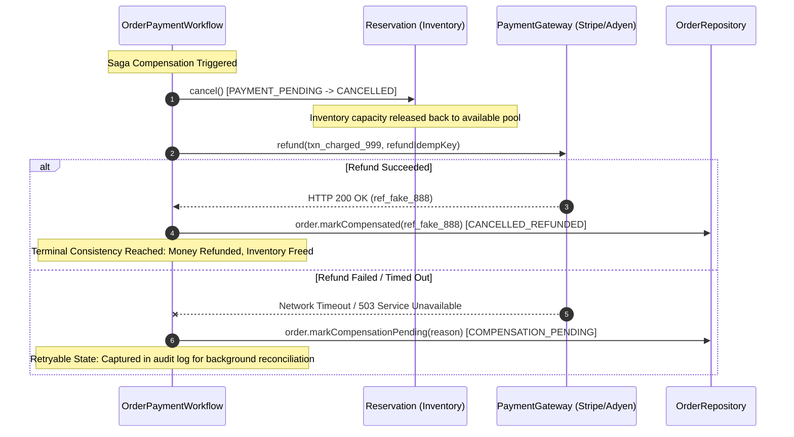

# Saga Workflow Compensation Diagram (LAB-803)

## 1. The Post-Payment Failure Problem

When ticket generation or database confirmation crashes after the customer's card has already been charged:



---

## 2. Saga Compensating Action Flow

The Orchestrator coordinates compensating transactions in reverse order:



---

## 3. Retryable Compensation Loop

When the refund fails on the initial attempt, the workflow does not panic or lose track of money:

```mermaid
flowchart TD
    Start([Post-Payment Failure]) --> CancelRes[Cancel Reservation & Release Hold]
    CancelRes --> AttemptRefund[Attempt Gateway Refund #1]
    
    AttemptRefund -->|Fails / Timeout| CompPending[Order State: COMPENSATION_PENDING]
    CompPending --> LogAttempt[Log CompensationAttempt to Order Audit Trail]
    LogAttempt --> AwaitRetry[Background Reconciler / Retry Trigger]
    
    AwaitRetry --> RetryComp[retryCompensation()]
    RetryComp --> AttemptRefund2[Attempt Gateway Refund #2 with same Idempotency Key]
    
    AttemptRefund2 -->|Fails| CompPending
    AttemptRefund2 -->|Succeeds| CancelledRefunded[Order State: CANCELLED_REFUNDED]
    AttemptRefund -->|Succeeds| CancelledRefunded
    
    CancelledRefunded --> Terminal([Terminal Consistent State: Zero Customer Loss])
```
