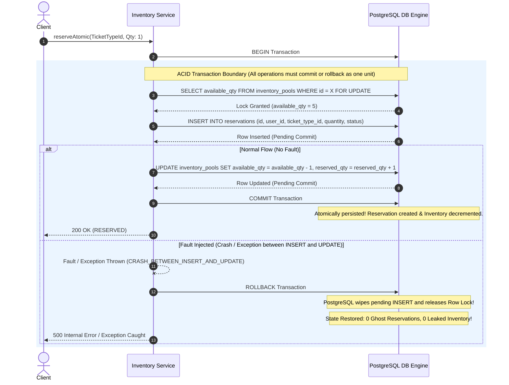

# Transaction Boundaries & Atomicity Specification

## 1. Overview
This document specifies the **ACID Atomicity Boundary** governing ticket reservations in Launchpad. It proves that creating a `Reservation` entitlement record and decrementing capacity in an `InventoryPool` are bound to a single transaction fence: **they must succeed together or fail together**.

---

## 2. Sequence Diagram: Transaction Fence & Mid-Operation Rollback

---

## 3. Review Questions & Distributed Architecture Analysis

### Question A: Which data MUST be in one local database transaction?
* **Answer**: The modification of `inventory_pools` (`available_qty`, `reserved_qty`) AND the creation of the `reservations` record MUST be executed within a single local PostgreSQL transaction.
* **Why**: If reservation insertion succeeds without updating inventory, a **Ghost Reservation** is created (a user holds a valid reservation reference, but the inventory pool has not deducted the count). Conversely, if inventory updates without creating a reservation row, an **Inventory Leak** occurs (capacity disappears with no owner record).

### Question B: What changes if `reservation` and `inventory` later live in different microservices?
* **Answer**: When decomposed into separate services with independent databases, local ACID transactions across service boundaries become impossible (dual-write problem).
* **Distributed Patterns Required**:
  1. **Saga Pattern (Orchestration or Choreography)**:
     - *Reserve Step*: Inventory Service locks/deducts local inventory and emits `InventoryReserved` event.
     - *Order Step*: Reservation Service receives event and creates reservation record.
     - *Compensating Transaction*: If Reservation Service fails, it emits `ReservationFailed`, triggering a compensating transaction on Inventory Service (`UPDATE inventory_pools SET available_qty = available_qty + 1`).
  2. **Transactional Outbox Pattern**: Inventory Service writes its change and an outbox event into its local database transaction, guaranteeing message delivery via CDC (Change Data Capture like Debezium) without 2-phase commit (2PC).

---

## 4. Sprint 2 Retrospective

### 1. Which concurrency primitive solved correctness?
* **Pessimistic Row Locking (`SELECT ... FOR UPDATE`)** combined with **Atomic Conditional SQL Updates (`WHERE available_qty >= X`)** inside PostgreSQL local transactions.
* *Why it works*: It forces competing transactions on the exact same inventory pool row to queue at the database engine level, ensuring every transaction reads the true updated state committed by the preceding request.

### 2. What bottleneck did correctness introduce?
* **Serialized Throughput Constraint**: Locking a single row serializes all concurrent updates targeting that specific ticket tier.
* *Performance Metric*: Bound to single-thread SQL lock commit speed (~400-800 reservations/sec per individual row).
* *Future Scaling Path*: To scale beyond 1,000 reservations/sec for mega-events, we can introduce **Inventory Partitioning** (sharding capacity across multiple database rows, e.g. Pool 1..N) or **Redis Distributed Token Buckets**.
