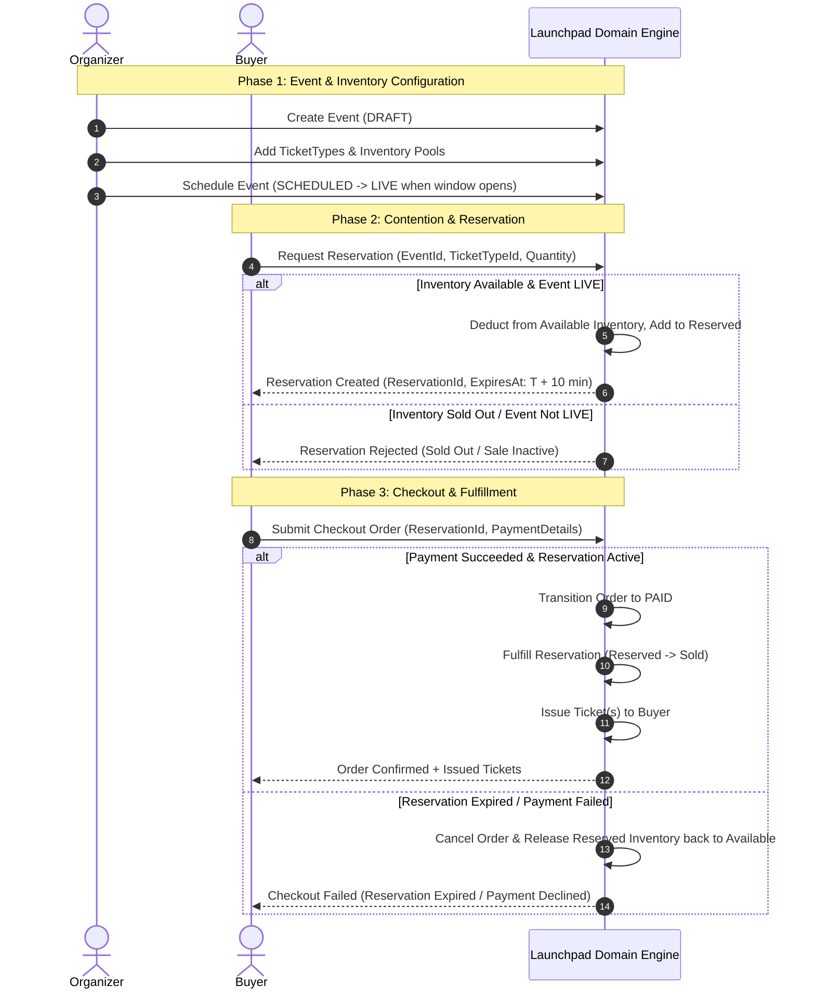

# Domain Glossary & Language Disambiguation

## Problem Statement
Terms like *event*, *ticket*, *inventory*, *reservation*, and *order* are frequently overloaded in event management and ticketing platforms. Ambiguity in language leads to ambiguity in code boundaries, race conditions, data corruption, and bloated domain models. This document establishes an unambiguous domain vocabulary for Launchpad.

---

## 1. Actors & Goals

### Organizer
* **Role**: The producer or manager responsible for hosting an event and offering inventory to the public.
* **Goals**:
  * Create and configure events with sellable ticket tiers (`TicketType`).
  * Set ticket prices, inventory allocations, and sale opening/closing windows.
  * Monitor inventory consumption and manage event lifecycle (e.g., publish, postpone, or cancel events).

### Buyer (User)
* **Role**: An end customer who wants to attend an event by acquiring valid tickets.
* **Goals**:
  * Discover live or upcoming events.
  * Hold/Reserve limited ticket inventory under high contention before it sells out.
  * Complete payment for held reservations within a specified time limit to secure confirmed tickets.

### Launchpad Platform (System Context)
* **Role**: The domain engine that manages inventory allocations, enforces reservation holds, processes order checkouts, and issues ticket entitlements.
* **Goals**:
  * Prevent overbooking of limited inventory under peak contention.
  * Guarantee deterministic state transitions across reservations, orders, and payments.

---

## 2. Overloaded Terms & Disambiguation

| Overloaded Term | Ambiguous Context | Precise Domain Definition |
| :--- | :--- | :--- |
| **Event** | Can mean the physical concert, the web listing, or the sale window. | **Event**: A sellable occurrence managed by an Organizer with explicit lifecycle states (`DRAFT`, `SCHEDULED`, `LIVE`, `ENDED`, `CANCELLED`) and defined sale windows. |
| **Ticket** | Often confused with `TicketType`, `Inventory`, or `Boarding Pass`. | **Ticket**: An issued, individual, non-duplicable digital entitlement assigned to a specific owner upon successful payment of an order. |
| **TicketType** | Often confused with individual ticket instances or price tiers. | **TicketType**: A category/tier of admission (e.g., General Admission, VIP) belonging to an Event, defining unit price and allocated capacity pool. |
| **Inventory** | Can mean warehouse count, database table, or live seat counts. | **Inventory Pool**: The authoritative aggregate quantity of available capacity assigned to a `TicketType`. |
| **Reservation** | Often confused with a completed booking or shopping cart. | **Reservation**: A temporary, time-bounded lock on a specific quantity of inventory for a single user. Holds inventory exclusively while pending payment. |
| **Order** | Can mean shopping cart, checkout attempt, or receipt. | **Order**: A commercial transaction record binding one or more active Reservations to a payment intent and total monetary amount. |

---

## 3. Entity vs. Value Object Candidates

### Entities (Identity-Driven Objects)

1. **`Event`**
   * **Identity**: `EventId` (UUID)
   * **Mutable State**: Lifecycle Status, Sale Windows, List of `TicketType`s.
   * **Responsibility**: Manages overall event lifecycle and ticket tier definitions.

2. **`Reservation`**
   * **Identity**: `ReservationId` (UUID)
   * **Mutable State**: Status (`ACTIVE`, `EXPIRED`, `FULFILLED`, `CANCELLED`), Expiration Timestamp (`expiresAt`).
   * **Responsibility**: Represents temporary ownership of reserved capacity for a user.

3. **`Order`**
   * **Identity**: `OrderId` (UUID)
   * **Mutable State**: Status (`PENDING_PAYMENT`, `PAID`, `EXPIRED`, `REFUNDED`).
   * **Responsibility**: Tracks financial intent, payment correlation, and itemized breakdown.

4. **`Ticket`**
   * **Identity**: `TicketId` (UUID)
   * **Mutable State**: Status (`VALID`, `USED`, `VOIDED`, `REFUNDED`).
   * **Responsibility**: Represents an issued access entitlement.

### Value Objects (Attribute-Driven & Immutable)

1. **`Money`**: Comprises `amount` (Decimal/Integer cents) and `currency` (e.g., `USD`). Cannot be negative.
2. **`Quantity`**: Non-negative integer representing item count.
3. **`TimeWindow`**: Comprises `startAt` and `endAt` timestamps. Enforces `startAt < endAt`.
4. **`ReservationWindow`**: Duration (e.g., 10 minutes) during which a reservation remains valid before auto-expiring.

---

## 4. Core User Journey Map

---

## 5. Domain Unknowns & Explicit Assumptions

| Category | Recorded Unknown / Assumption | Domain Decision |
| :--- | :--- | :--- |
| **Max Hold Limit** | How many tickets can a single user reserve per event? | **Decision**: Enforce a hard maximum of **4 tickets per user per event** across all active reservations. |
| **Partial Payments** | Does the system allow installment or partial payments for reservations? | **Decision**: Out of domain scope. Orders must be paid in full in a single payment transaction. |
| **Seated vs General Admission** | Do reservations map to specific row/seat numbers or tier counts? | **Decision**: Current domain models quantity-based tier inventory pools (`General Admission`). Seated mapping is deferred to future extensions. |
| **Refund Policy** | What happens if an event is cancelled by the Organizer? | **Decision**: Cancelled events transition all confirmed orders to `REFUNDED` and invalidate issued tickets. |
