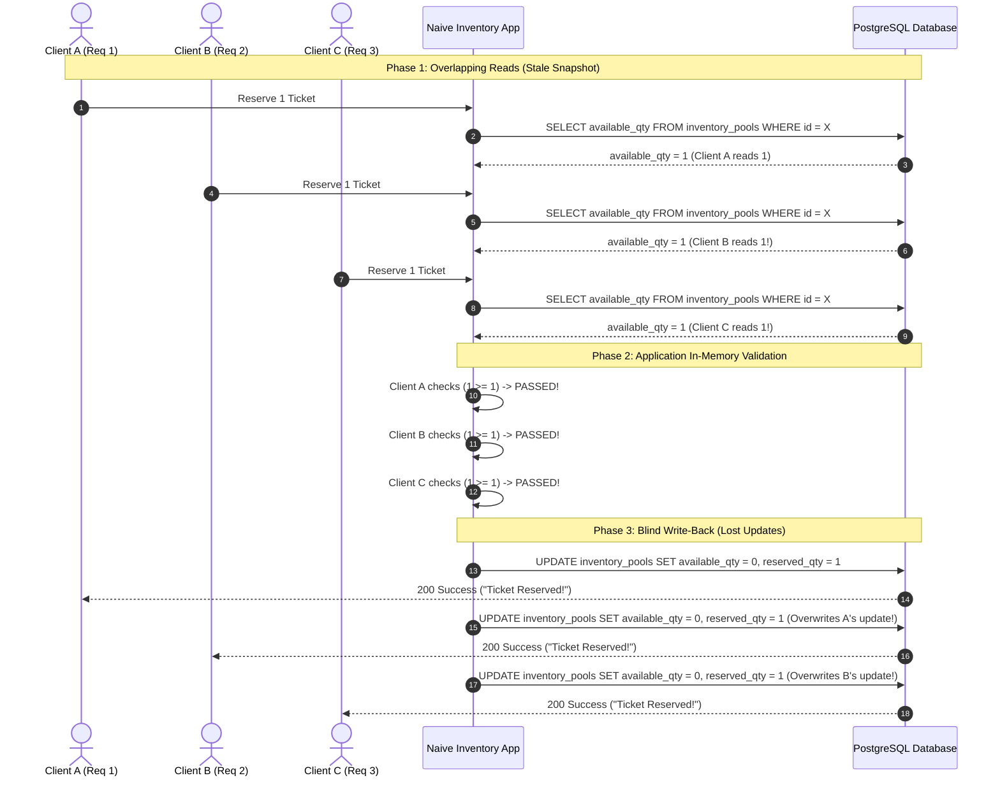

# Incident Note: Oversell Reproduction Under Concurrency

* **Incident ID**: INC-LAB-201
* **Severity**: Critical (P0 Data Corruption / Overbooking)
* **Status**: Confirmed & Reproduced
* **Date**: 2026-09-08
* **Component**: `InventoryPool` / Reservation Flow

---

## 1. Executive Summary

During a simulated high-contention flash drop event, **100 concurrent reservation attempts** competed for **1 single ticket**.

Due to naive (unlocked, non-atomic) application-level Read-Modify-Write logic:
* **97 out of 100 concurrent users** received a `200 OK / Success` confirmation for the single ticket.
* **96 extra users** were granted fraudulent ticket reservations beyond actual venue capacity.
* PostgreSQL recorded `Available = 0, Reserved = 1`, completely masking the fact that 97 separate users were told they won the reservation!

---

## 2. Sequence Diagram: Interleaving Trace

The sequence diagram below illustrates how 3 concurrent HTTP handler threads ($T_A$, $T_B$, $T_C$) interleave their SQL queries on PostgreSQL:

---

## 3. Instruction-by-Instruction Breakdown

Here is the exact CPU and SQL instruction execution timeline that causes the oversell:

| Timeline ($T$) | Worker Thread | Operation / Executed SQL Instruction | Shared DB State (`available_qty`) | Thread Local State | Result |
| :--- | :--- | :--- | :--- | :--- | :--- |
| **$T_0$** | System | Initial DB State | `1` | N/A | Total Capacity = 1 |
| **$T_1$** | Thread A | `SELECT available_qty ...` | `1` | `read_qty = 1` | Reads snapshot = 1 |
| **$T_2$** | Thread B | `SELECT available_qty ...` | `1` | `read_qty = 1` | Reads snapshot = 1 (stale) |
| **$T_3$** | Thread C | `SELECT available_qty ...` | `1` | `read_qty = 1` | Reads snapshot = 1 (stale) |
| **$T_4$** | Thread A | `if (read_qty >= 1)` | `1` | `1 >= 1` is `TRUE` | Check passes |
| **$T_5$** | Thread B | `if (read_qty >= 1)` | `1` | `1 >= 1` is `TRUE` | Check passes |
| **$T_6$** | Thread C | `if (read_qty >= 1)` | `1` | `1 >= 1` is `TRUE` | Check passes |
| **$T_7$** | Thread A | `UPDATE ... SET available_qty = 0` | `0` | Success | Returns `200 Success` to Client A |
| **$T_8$** | Thread B | `UPDATE ... SET available_qty = 0` | `0` | Success | **Overwrites DB**. Returns `200 Success` to Client B! |
| **$T_9$** | Thread C | `UPDATE ... SET available_qty = 0` | `0` | Success | **Overwrites DB**. Returns `200 Success` to Client C! |

---

## 4. Review Questions Answered

### Q1: What exact interleaving causes the bug?
* **Answer**: The bug occurs when multiple concurrent request handler threads execute their `SELECT` read step **before** any preceding thread executes its `UPDATE` write step. Because default `READ COMMITTED` isolation level allows non-blocking read snapshots, all threads see `available_qty = 1`, pass their local `if (1 >= 1)` check, and issue un-locked `UPDATE` queries that overwrite each other.

### Q2: Why do unit tests often miss it?
* **Answer**: Unit tests run sequentially in a single process thread (e.g. `test1() -> test2() -> test3()`). In sequential execution, Thread A completes its entire read-modify-write cycle and commits `available_qty = 0` before Thread B starts. The interleaving window ($T_1 \dots T_6$) never occurs in single-threaded unit tests.

---

## 5. ADVANCEMENT GATE DEFENSE

> [!CAUTION]
> **No Fix Implemented Yet**: In accordance with the advancement gate instructions, no locking mechanisms (`SELECT FOR UPDATE`, version columns, or conditional SQL checks) have been applied yet. We have strictly reproduced, measured, and documented the failure trace first.
