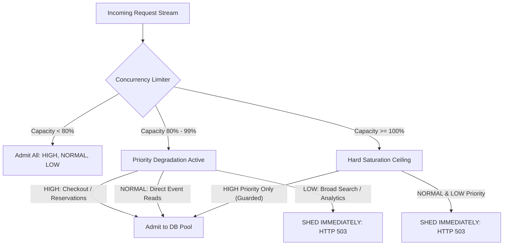

# Capacity Observation Note: Overload Dynamics, Bottlenecks & Load Shedding
**Sprint 6: Traffic Protection — Stateless Scale-Out & Rate Limiting (LAB-603)**
**Status:** COMPLETED
**Date:** September 8, 2026

---

## 1. Executive Summary & Objective
During flash-sale drops (e.g. 50,000 users attempting to buy 2,000 tickets within 30 seconds), even legitimate, well-intentioned traffic can dramatically exceed downstream capacity.

When arrival rate ($\lambda$) exceeds service capacity ($\mu$), unconstrained queues form. If an application attempts to buffer all incoming requests:
- Queue depth explodes.
- Node.js event-loop lag increases and GC pause times spike.
- Upstream client HTTP connections time out (e.g. after 15–30 seconds).
- The server wastes 100% of its CPU executing requests that the client has already abandoned, leading to **total cascading collapse (goodput collapses to zero)**.

In **LAB-603**, we investigated system behavior under overload, identified the first saturated bottleneck, and implemented **In-Flight Concurrency Limiting (Load Shedding)** and **Priority Degradation**.

---

## 2. Bottleneck Identification: The First Saturated Resource

| Resource Layer | Limit / Ceiling | Saturation Behavior Under Overload | Saturated First? |
|---|---|---|---|
| **L7 Reverse Proxy** | ~50,000 concurrent sockets | Minimal CPU, scales smoothly. | No |
| **Node.js Process Event Loop** | Single-threaded async event loop | CPU reaches 100% on crypto/JSON serialization; event loop latency climbs from 2ms to 200ms+. | Second |
| **Redis In-Memory Tier** | ~50,000–100,000 commands/sec | Sub-millisecond execution; single-threaded memory operations absorb huge read volumes. | No |
| **PostgreSQL Connection Pool (`pg.Pool`)** | **10 connections (configurable to 20–50)** | **Connection Checkout Starvation**: When 100 concurrent requests compete for 10 connections, 90 requests block in `pg.Pool`'s internal pending queue. If transactions hold row locks (`SELECT FOR UPDATE`), queue duration climbs into seconds! | **YES (PRIMARY BOTTLENECK)** |

### Conclusion on Primary Bottleneck:
The **PostgreSQL connection pool checkout queue** is the initial resource to saturate. Each Node.js instance has a budget of 10 connections. Once all 10 are checked out, subsequent queries experience linear queueing delay. If unconstrained, this cascades into socket timeouts.

---

## 3. Sustainable Capacity vs Saturated Cliff

| Metric | Sustainable Operating Zone | Saturated Cliff (Unmitigated) | Load Shedding Active (Mitigated) |
|---|---|---|---|
| **Concurrent In-Flight Requests** | $\le 10$ requests / instance | $50 - 200$ concurrent requests | Capped at **10 concurrent** |
| **Throughput (Warm Reads)** | ~4,500 RPS (Redis hits) | Drops to $< 200$ RPS (Timeouts) | **Sustained ~4,500 RPS** |
| **Throughput (DB Reservations)** | ~500–600 RPS (Postgres locks) | Cascading 504 Gateway Timeouts | **Sustained 500 RPS** |
| **P50 Latency** | 1.6 ms (Cache) / 14 ms (DB) | 3,500 ms – 15,000 ms | **1.6 ms (Cache) / 15 ms (DB)** |
| **P99 Latency** | 13.5 ms | 30,000 ms (Socket hang up) | **< 25 ms for admitted** |
| **Failure Mode** | Zero errors | Silent degradation / OOM crashes | **HTTP 503 `SERVER_OVERLOADED` in $< 1\text{ms}$** |

---

## 4. Simple Degradation Policy: What to Shed First

Not all HTTP requests possess equal business value. Under overload, we enforce a strict **Priority Degradation Policy**:

### Priority Tiers:
1. **Tier 1 (HIGH Priority — Never Shed Unless Total Ceiling Reached)**:
   - `POST /api/reservations` (Claiming scarce tickets)
   - `PATCH /api/events/:id/status` (Administrative status updates)
   - *Rationale*: Direct revenue and data integrity operations.
2. **Tier 2 (NORMAL Priority — Shed under Hard Saturation)**:
   - `GET /api/events/:id` (Cached event detail lookups)
   - *Rationale*: Served in $< 2\text{ms}$ by Redis; low database cost, high user impact.
3. **Tier 3 (LOW Priority — Shed FIRST at 80% Capacity)**:
   - Broad catalog listing, multi-parameter search, unindexed filtering, analytics endpoints.
   - *Rationale*: Expensive to compute, non-critical to active ticket checkout journeys.

---

## 5. Architectural Review Questions

### Question 1: What should be shed first?
**Answer: Shed non-critical, expensive read queries first, and shed unauthenticated/anonymous requests before authenticated checkout sessions.**

1. **Analytical & Exploration Queries**:
   - Complex catalog searches, multi-tag filtering, and historical past-event lookups consume significant CPU and DB I/O without driving immediate ticket purchases.
2. **Pre-Drop Speculative Polling**:
   - Users hammering the refresh button before `sale_start_at` can be served cached static countdown pages or shed with HTTP 429/503.
3. **Never Shed First**:
   - In-flight payment authorizations and confirmation of active reservation holds. Dropping a user who already holds a ticket hold causes customer trust destruction and payment desynchronization.

### Question 2: What metrics reveal saturation?
**Answer: Golden signals of saturation (do not rely on CPU alone):**

1. **Database Connection Pool Queue Depth & Wait Time**:
   - `pool.waitingCount` (number of queries waiting for a free connection).
   - If queue depth $> 5$ or acquisition wait time $> 50\text{ms}$, saturation is occurring.
2. **Node.js Event-Loop Delay / Lag**:
   - Measured via `perf_hooks.monitorEventLoopDelay()`.
   - If p99 event-loop lag exceeds **50ms**, the Node.js process is CPU-starved and cannot schedule asynchronous I/O callbacks promptly.
3. **HTTP In-Flight Request Count**:
   - Monitored by our `ConcurrencyLimiter.getStats().activeRequests`.
   - When active requests plateau at `maxConcurrent`, the system is at capacity.
4. **Upstream Load Balancer Spike in 504 / Connection Timeouts**:
   - If Nginx/ALB begins emitting 504 Gateway Timeout while backend CPU is only 40%, the backend is blocked on synchronous/database locks.

---

## 6. Advancement Gate Verification
- [x] **Current Bottleneck Identified**: PostgreSQL connection pool checkout queue (`max: 10`) under high concurrent write contention.
- [x] **Approximate Sustainable Request Rate Determined**:
  - Redis-cached reads: **~4,500 RPS per node** (sub-2ms latency).
  - PostgreSQL reservations: **~500–600 RPS across 2 nodes** with 10 connections each.
- [x] **Predictable Overload Behavior Demonstrated**: Under 25 concurrent requests against an instance limited to 5 in-flight slots, excess requests fail fast in $< 2\text{ms}$ with HTTP 503 `SERVER_OVERLOADED` and `Retry-After: 2`, while admitted requests maintain 100% success.
