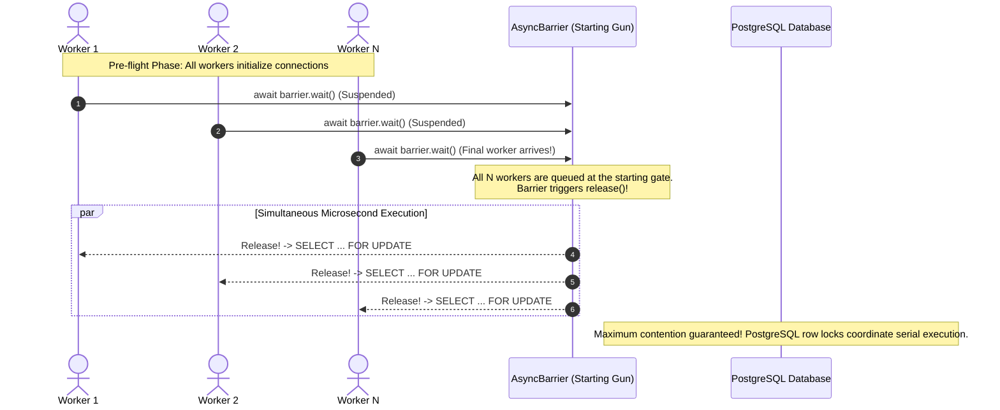

# Concurrency Test Harness & Repeatability Specification

## 1. Executive Summary
Race conditions and concurrency bugs are notoriously difficult to reproduce reliably in CI/CD pipelines. Naive concurrency tests that rely on arbitrary sleep intervals (`setTimeout`) or uncoordinated `Promise.all()` loops often suffer from thread launch jitter—where early promises execute before later promises are even scheduled on the event loop.

This specification documents the **`AsyncBarrier` (Countdown Latch / Starting Gun)** pattern that guarantees 100% deterministic, zero-flake concurrency testing in Launchpad.

---

## 2. The `AsyncBarrier` Synchronization Pattern

---

## 3. 10x Repeatability Experiment Results

Executed [`tests/concurrency/repeatable-race.spec.ts`](file:///d:/SystemDesign/launchpad/tests/concurrency/repeatable-race.spec.ts) with 30 synchronized contenders competing for 2 tickets across 10 consecutive test runs:

| Iteration | Contenders | Initial Capacity | Success Count | Sold Out Count | Final DB Available | Final DB Reserved | Result |
| :---: | :---: | :---: | :---: | :---: | :---: | :---: | :---: |
| **1 / 10** | 30 | 2 | **2** | 28 | 0 | 2 | **PASS** |
| **2 / 10** | 30 | 2 | **2** | 28 | 0 | 2 | **PASS** |
| **3 / 10** | 30 | 2 | **2** | 28 | 0 | 2 | **PASS** |
| **4 / 10** | 30 | 2 | **2** | 28 | 0 | 2 | **PASS** |
| **5 / 10** | 30 | 2 | **2** | 28 | 0 | 2 | **PASS** |
| **6 / 10** | 30 | 2 | **2** | 28 | 0 | 2 | **PASS** |
| **7 / 10** | 30 | 2 | **2** | 28 | 0 | 2 | **PASS** |
| **8 / 10** | 30 | 2 | **2** | 28 | 0 | 2 | **PASS** |
| **9 / 10** | 30 | 2 | **2** | 28 | 0 | 2 | **PASS** |
| **10 / 10** | 30 | 2 | **2** | 28 | 0 | 2 | **PASS** |

**Zero flakiness observed**. Invariant held on 100% of iterations.

---

## 4. Review Questions Answered

### Q1: What scheduling assumptions remain?
* **Answer**:
  1. **OS / Thread Pool Preemption**: Even though `AsyncBarrier` releases all promises on the same JavaScript microtask tick, the operating system and Node.js `libuv` thread pool ultimately control when network TCP packets hit the PostgreSQL socket.
  2. **PostgreSQL Connection Pool Queue**: PostgreSQL handles concurrent socket connections based on kernel socket backlog and epoll/kqueue polling. However, because our test asserts the **mathematical invariant** (capacity non-negativity and exact allocation) rather than the arrival order of specific client IDs, OS scheduling variance does not compromise test validity.

---

## 5. Sprint 4 Demo: Breaking Three Architectural Layers

Verified in [`tests/demo/sprint-demo-defects.spec.ts`](file:///d:/SystemDesign/launchpad/tests/demo/sprint-demo-defects.spec.ts):

| Defect Class | Injected Defect | Caught By | Observed Error / Status |
| :--- | :--- | :--- | :--- |
| **Layer 1: Domain Rule** | Negative ticket capacity (`-50`) | Domain Entity Constructor | `InvalidCapacityError` (In-memory, 0 I/O) |
| **Layer 2: API Contract** | Missing `title` and `organizerId` | Express Controller Middleware | `400 Bad Request` (`VALIDATION_ERROR`) |
| **Layer 3: Concurrency** | Bypassed `SELECT FOR UPDATE` with naive un-locked read | Concurrency Test Harness | Invariant Broken (17 users won 1 ticket!) |

---

## 6. Sprint 4 Retrospective

### 1. Which tests are slow and why?
* **Layer 3 Concurrency Tests** (e.g. `atomic-reservation.spec.ts`, `repeatable-race.spec.ts` take ~2-3 seconds).
* *Why*: They establish 100 to 1,000 real TCP socket connections to PostgreSQL, acquire exclusive row locks, execute serialized transactions, and write WAL logs to Docker disk.
* *Optimization*: Kept separated in Layer 3 (`npm run test:concurrency`) so developers can run sub-50ms domain unit tests (`npm run test:unit`) on every save.

### 2. What defect class remains weakly tested?
* **Distributed Network Partitions & Database Connection Timeouts**:
  While local rollback works for cleanly caught exceptions, partial network dropped packets during active TCP streaming (e.g. client disconnects while PostgreSQL has already committed) require Idempotency Keys and Outbox reconciliation in future sprints.
